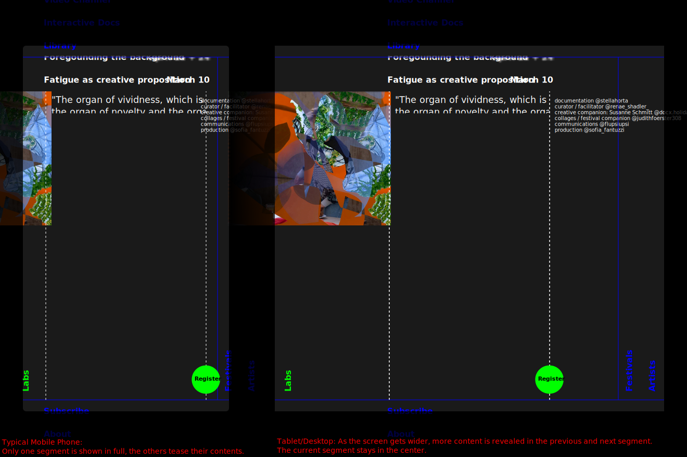

This is the new Moving Across Thresholds website.

Right now, you can't see anything yet.
This week, I'll create the prototype, and a link to test it will appear here.

Until then, check out the [DESIGN Document](./DESIGN.md) to see what I'm currently implementing.

## Progress

### This Week

- [ ] Ingest initial content
    - [x] are.na embed
    - [x] vimeo embed (with tracking disabled to comply with EU laws)
    - [ ] Hypertext content
    - [ ] Images (initially served via Google Docs)
- [x] Arrange initial content into `Zipper` structure
- [x] Create simple theme
- [x] Display `Zipper` as Accordion
- [x] Allow linking to any Segment inside the Accordion
- [ ] Animate moving across Segments
- [ ] Deploy to [movingAcrossThresholds.com](movingAcrossThresholds.com)

------------------ Milestone #1: MVP done ------------------

### March

- [ ] Add User Login for `movingacrossthresholds@gmail.com`
- [ ] Make data editable
- [ ] Add Photo Upload feature with automatic compression

------------------ Milestone #2: Backend done ------------------

### April and beyond

- [ ] Fine-tune Layout features and add toolbar for WYSIWYG editing

------------------ Milestone #3: WYSIWYG done ------------------

- [ ] Improve animations
- [ ] Improve Colors

------------------ Milestone #4: Usability improvements done ------------------


## Prior work

For more concrete discussion of content and structure, check out these **collaborative docs:**

- [Example Sites; Some example Content](https://docs.google.com/document/d/1WBk1p87gxW8zPPTjid2BupmaUjcJCX3DvfpehNbtFUw/edit?usp=sharing)
- [Layout](https://docs.google.com/document/d/1zC7TirujtAtsySjGhr_0QOIqSRf53j6Xw_1FAXzUpNA/edit?usp=sharing)
- [Structure](https://docs.google.com/document/d/1gWE5tKyMtmpZlIjN4wl592KyJVVSWHRb8MFjTggPXpM/edit?usp=sharing)

## Sketches and Drafts


Sketch of Measures (vertical and horizontal rhythm) and potential Colors, by Flupsi, 22-03-07


Sketch of a Look, as the screen expands, by Flupsi, 22-03-04


# Development

## Code Documentation

Install elm-doc-preview and run `edp` to launch a local documentation server.

```sh
edp --no-browser --port 1234
```

## Verify examples

Run `elm-verify-examples` and `elm-test` to verify the correctness of the examples given in the documentation.

```sh
elm-verify-examples && elm-test
```

```sh
elm-verify-examples --run-tests
```

## Run

```sh
npm install -g elm-live
```

```sh
elm-live src/Main.elm -- --output=main.js
```