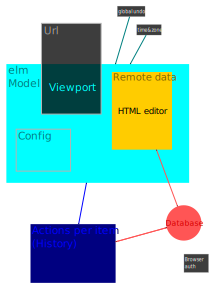

This is the code for the new _Moving Across Thresholds_ website. Go to [MovingAcrossThresholds.com](movingAcrossThresholds.com) to see the current live version. Some updates may not yet been published.

For an up-to-date code documentation, install `yarn` and `elm-doc-preview`, then run `yarn doc` and navigate to `<dev IP>:8000`

The [DESIGN](./DESIGN.md) and [SPECIFICATION document](SPECIFICATION.md)s are out of date.


## Progress

Since May 2022, all issues are tracked on [github issues](https://github.com/upsiflu/matsite/issues).


## Inspiration and Thought process

For more concrete discussion of content and structure, check out these **collaborative docs:**

- [Example Sites; Some example Content](https://docs.google.com/document/d/1WBk1p87gxW8zPPTjid2BupmaUjcJCX3DvfpehNbtFUw/edit?usp=sharing)
- [Layout](https://docs.google.com/document/d/1zC7TirujtAtsySjGhr_0QOIqSRf53j6Xw_1FAXzUpNA/edit?usp=sharing)
- [Structure](https://docs.google.com/document/d/1gWE5tKyMtmpZlIjN4wl592KyJVVSWHRb8MFjTggPXpM/edit?usp=sharing)

## Sketches and Drafts


Sketch of Measures (vertical and horizontal rhythm) and potential Colors, by Flupsi, 22-03-07


Sketch of a Look, as the screen expands, by Flupsi, 22-03-04


# Run it

Install `yarn` and `cross-env` to execute the scripts defined in [package.json](package.json)

## Code Documentation

`yarn doc`

Install elm-doc-preview and run `edp` to launch a local documentation server.

```sh
edp --no-browser --port 1234
```

## Verify examples

`yarn verify`

Run `elm-verify-examples` and `elm-test` to verify the correctness of the examples given in the documentation.

```sh
elm-verify-examples && elm-test
```

```sh
elm-verify-examples --run-tests
```

## Run on the localhost

`yarn local`


## Run on the local network

`yarn dev`

will run the development version on port 1234 of your development computer

----

```sh
npm install -g elm-live
```

```sh
elm-live src/Main.elm -v --host=192.168.178.93 --pushstate --port=8000 -- --output=main.js --debug
```


# Deployment

Install `firebase` and deploy via

```sh
yarn clear-build-cache && yarn build && firebase deploy
```


# Code organisation

Elm, scss and js modules are ordered under [src](src/) in a type-centric order.

**Canvas**: We leverage the native scroll facilities. Unfortunately, mobile and desktop browsers behave very differently and very, very weirdly. 

Which web platform APIs can we safely use?

- Each segment of the Accordion must be focusable so that one can edit it. Since they are about screen-sized, we simply define that _the segment under the screen-cursor has focus_.
- While scrolling, the screen-cursor should be visible.
- When ending a scroll, 
  - in case a segment other than the focus is under the screen-cursor, fire `scrolledToA <id>`.
  - in case there is no segment visible on screen, fire a `scrolledIntoNowhere` event.
  - otherwise, do nothing

**Hypertext content**: A custom element that connects to a data-node, reading and writing HTML. For editing purposes, we use the squire which relies on browser implementations. To enable global undo, we want to route any change through an ACTION. The costom element node is only renewed when a remote client changes the...
QUESTION: Should the custom element connect directly to the firestore, or through elm? We can definitely implement global UNDO through a central registry list of user-initiated actions and stuff. This would make the elm-state orthogonal to each data-state, which is desireable because elm doesn't display the HTML itself.



_Dataflows:_
- Url determines Viewport;
- Global undo and time&zone affect elm model;
- Each Html editor syncs with the database;
- Browser authorizes the database
- Elm reads and writes histories per item, and database persists these
- Config is volatile (not persisted)


# Libraries

- [https://github.com/ThatGuySam/vumbnail](vumbnail) creates and caches Vimeo thumbnais (ISC or MIT license)
- Firebase stores the data that can be edited through the CMS, and distributes it
- [https://github.com/neilj/Squire](Squire) is a simple Html WYSIWYG editor (MIT license)

Thank you to the creators of these libraries, as well as to the lovely Elm community!